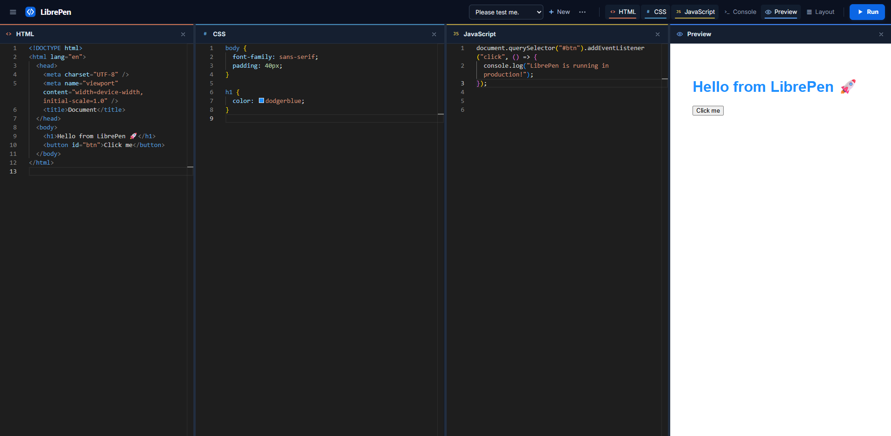

# LibrePen

LibrePen is a free and open-source browser-based HTML, CSS, and JavaScript playground for learning, experimenting, and building small web projects.

**Live demo:** [librepen.vercel.app](https://librepen.vercel.app)

## LibrePen in action



## About

LibrePen provides a focused front-end workspace that runs entirely in the browser. No account is required: open the app, create a project, write code, and view the result immediately.

## Features

- HTML, CSS, and JavaScript editors powered by Monaco Editor
- Live Preview and integrated Console
- Manual Run and optional Auto Run
- Multiple local projects with rename, delete, trash, and restore workflows
- Project import and export using the .librepen.json format
- Code formatting with Prettier
- HTML and CSS Emmet support
- JavaScript snippets and IntelliSense
- Configurable font size, tab size, word wrapping, minimap, semicolons, and quote style
- Resizable desktop layouts with saved panel visibility and sizes
- Single-panel mobile workspace with accessible tab navigation
- Keyboard-accessible dialogs, navigation, menus, and workspace controls
- Browser localStorage persistence
- No account required

## Live Demo

Use the deployed application at [https://librepen.vercel.app](https://librepen.vercel.app).

## Tech Stack

- React 19
- Vite
- Monaco Editor and @monaco-editor/react
- react-resizable-panels
- emmet-monaco-es
- Prettier

## Getting Started

Prerequisites:

- Node.js 20.19 or newer, or Node.js 22.12 or newer
- npm

```bash
git clone https://github.com/Luismiguel2530/librepen.git
cd librepen
npm install
npm run dev
```

Open the local URL printed by Vite.

## Available Scripts

- npm run dev — start the development server
- npm run build — create a production build in dist
- npm run preview — serve the production build locally
- npm run lint — run ESLint

## Project Structure

```text
public/                 Static public assets
src/
  components/           Editors, workspace, navigation, preview, and UI
  hooks/                Reusable React hooks
  utils/                Storage, formatting, layout, and project utilities
  App.jsx                Application state and orchestration
  App.css                Application design system and responsive styles
```

## Data and Privacy

LibrePen currently stores projects, settings, and workspace preferences in the browser's localStorage. Data is not synced to a LibrePen server, and no LibrePen account is required.

Clearing browser or site data can permanently remove locally stored projects. Use Export to create .librepen.json backups or move projects between browsers.

Preview runs user-authored JavaScript inside a sandboxed iframe. As with any code playground, only run code you understand and trust.

## Browser Support

LibrePen is designed for current versions of Chrome, Edge, Firefox, and Safari. JavaScript, localStorage, iframe support, and network access to the Monaco CDN are required for the complete experience.

## Roadmap

### Current v1

- Local-first browser playground
- Responsive desktop and mobile workspaces
- Accessible keyboard workflows
- Publicly deployed application

### Potential future work

- Optional accounts and cloud project sync
- Shareable project URLs
- Public and private projects
- Project forking
- Project history and versioning
- Collaboration features
- Additional editor improvements
- An official LibrePen QR code after deciding on a long-term custom domain

No dates are promised for roadmap items.

## Contributing

Contributions and focused bug reports are welcome. See [CONTRIBUTING.md](CONTRIBUTING.md) for the development workflow.

## License

LibrePen is available under the [MIT License](LICENSE).
